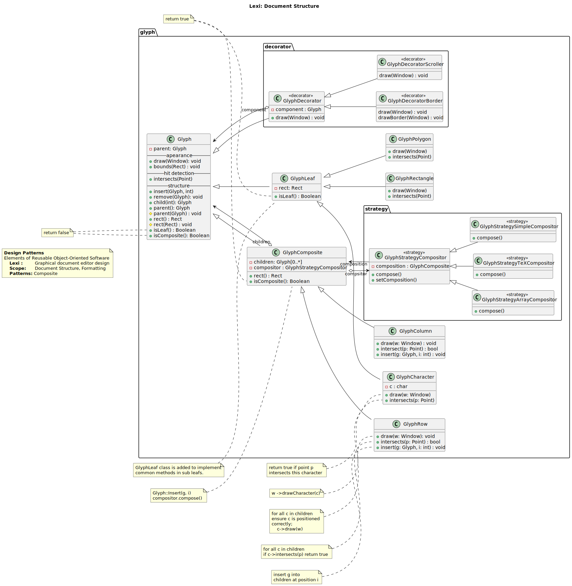
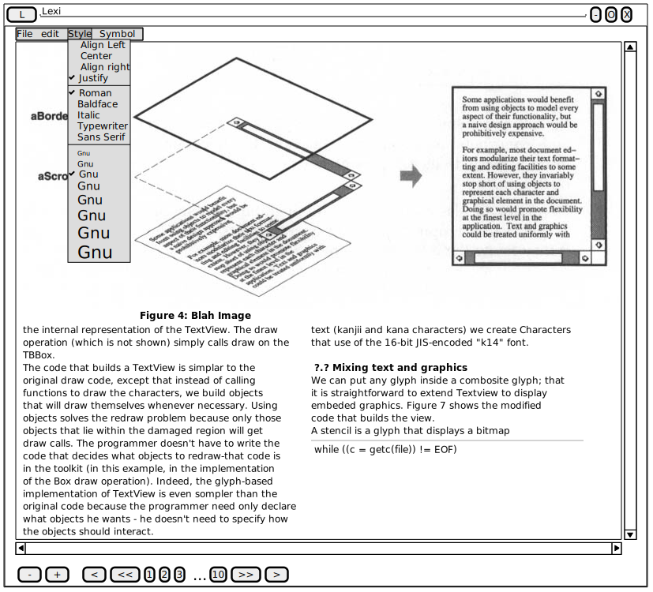

==================
Text Editor (Lexi)
==================

.. sectnum::

.. contents:: Table of Contents

Identification
==============

-------
Details
-------

.. csv-table::
    :width: 90%
    :widths: 20, 80
    :align: center

    Project, Text Editor (Lexi)
    Book, Design Patterns Elements of Reusable Object-Oriented Software
    Author, Ahmed Iraqi
    Version, 1.0

---------------
Version Control
---------------

.. csv-table::
    :header-rows: 1
    :width: 90%
    :widths: 5, 20, 20, 55
    :align: center

    "Version","Date","Author","Description"
    "1.0","2024-08-04", "Ahmed Iraqi", "Draft Version"

Overview
========

While reading the book as everyone else I thought that its impossible to appreciate those patterns
unless they are implemented in code, in order to get the feeling of the goal of those paterns,
and the ultimate goal is to get the taste of mixing and matching patterns in one solution, and this
goal cannot be achieved except by implementing chapter two case study in full.

This project contains all patterns sample codes, and test cases verifiying that they works
properly, and also the case study implementation of the Lexi Text Editor.

Working on this  project has went through all software development cycle, all the way through requirements gathering (during reading the book), design, implementation, testing, and deployment,
 and some post deployment technical support usage.

Requirements analysis
=====================

Design
======

-----------
Full Design
-----------

Below figure shows a full design of the Lexi Text editor according the book implementation.

    Figure 1.0: Lexi Text Editor class diagram

Figure 1.1, models the required Lexi user interface, as depected by the book.

    Figure 1.1: Lexi User interface

Implementation
==============

Implementing the project has been organized into several libraries, as follows

.. csv-table::
    :header-rows: 1
    :width: 90%

    "module", "description"
    "common", "Common classes used in all projects, e.g. List, Iterator, Point ... etc."
    "composite", "Composite pattern sample"
    "compositeapp","Composite application executable"
    "strategy", "Strategy Pattern sample"
    "strategyapp", "Strategy application executable"
    "lexi", "Lexi Text Editor implementation"
    "lexiapp", "Lexi Editor executable"

