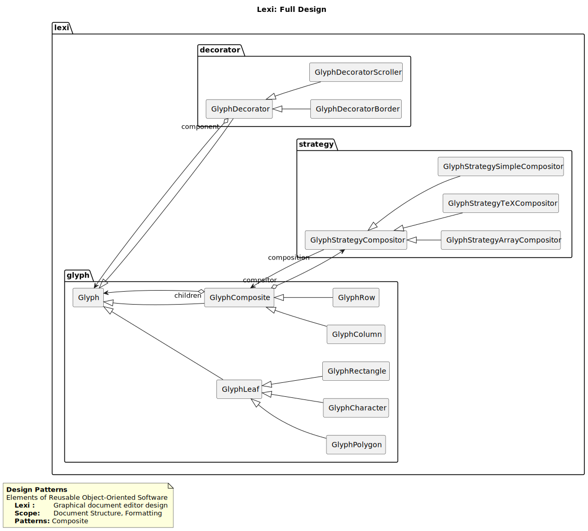

.. attention:: THIS IS A WORK IN PROGRESS PROJECT

==================
Text Editor (Lexi)
==================

.. sectnum::

.. contents:: Table of Contents

Identification
==============

-------
Details
-------

.. csv-table::
    :width: 90%
    :widths: 20, 80
    :align: center
    :stub-columns: 1

    Project, Text Editor (Lexi)
    Book, Design Patterns Elements of Reusable Object-Oriented Software
    Author, airaqi
    Version, 1.0

---------------
Version Control
---------------

.. csv-table::
    :header-rows: 1
    :width: 90%
    :widths: 5, 20, 20, 55
    :align: center

    "Version","Date","Author","Description"
    "1.0","2024-08-04", "Ahmed Iraqi", "Draft Version"

Overview
========

While reading the book as everyone else I thought that its impossible to appreciate those patterns
unless they are implemented in code, in order to get the feeling of the goal of those paterns,
and the ultimate goal is to get the taste of mixing and matching patterns in one solution, and this
goal cannot be achieved except by implementing chapter two case study in full.

This project contains all patterns sample codes, and test cases verifiying that they works
properly, and also the case study implementation of the Lexi Text Editor.

.. note:: 

    Working on this project went through all software development cycle, all the way through
    requirements gathering (during reading the book), design, implementation, testing, and
    deployment, and some post deployment technical support usage.

Patterns
========

All patterns structures has been documented and samples has been implemented.

.. csv-table::
    :header-rows: 1
    :width: 90%
    :align: center

    "Pattern","Description"
    `Abstract Factory <workspace/projects/patterns/abstract_factory>`_, "Provide an interface for creating families of related or dependent objects without specifying their concrete classes."
    `Composite <workspace/projects/patterns/composite/README.rst>`_, "Compose objects into tree structures to represent part-whole hierarchies."
    `Decorator <workspace/projects/patterns/decorator/README.rst>`_, "Attach additional responsibilities to an object dynamically. Decorators provide a flexible alternative to subclassing for extending functionality"
    `Singleton <workspace/projects/patterns/singlton/README.rst>`_, "Ensure a class only has one instance, and provide a global point of access to it."
    `Strategy <workspace/projects/patterns/strategy/README.rst>`_, "Define a family of algorithms, encapsulate each one, and make them interchangeable. Strategy lets the algorithm vary independently from clients that use it."
    `Factory Method <workspace/projects/patterns/factory_method/README.rst>`_, "Define an interface for creating an object, but let subclasses decide which class to instantiate. Factory Method lets a class defer instantiation to subclasses."

Requirements analysis
=====================

.. figure:: workspace/projects/lexi/docs/lexi_page.svg
    :width: 827
    :height: 920
    :scale: 60%
    :figwidth: 90%

    Figure 1.1: Lexi User interface

Design
======

-----------
Full Design
-----------

Below figure shows a full design of the Lexi Text editor according the book implementation.

    Figure 1.0: Lexi Text Editor class diagram

Figure 1.1, models the required Lexi user interface, as depected by the book.

Implementation
==============

Implementing the project has been organized into several libraries, as follows

.. csv-table::
    :header-rows: 1
    :width: 90%

    "module", "description"
    "common", "Common classes used in all projects, e.g. List, Iterator, Point ... etc."
    "composite", "Composite pattern sample"
    "compositeapp","Composite application executable"
    "strategy", "Strategy Pattern sample"
    "strategyapp", "Strategy application executable"
    "lexi", "Lexi Text Editor implementation"
    "lexiapp", "Lexi Editor executable"

