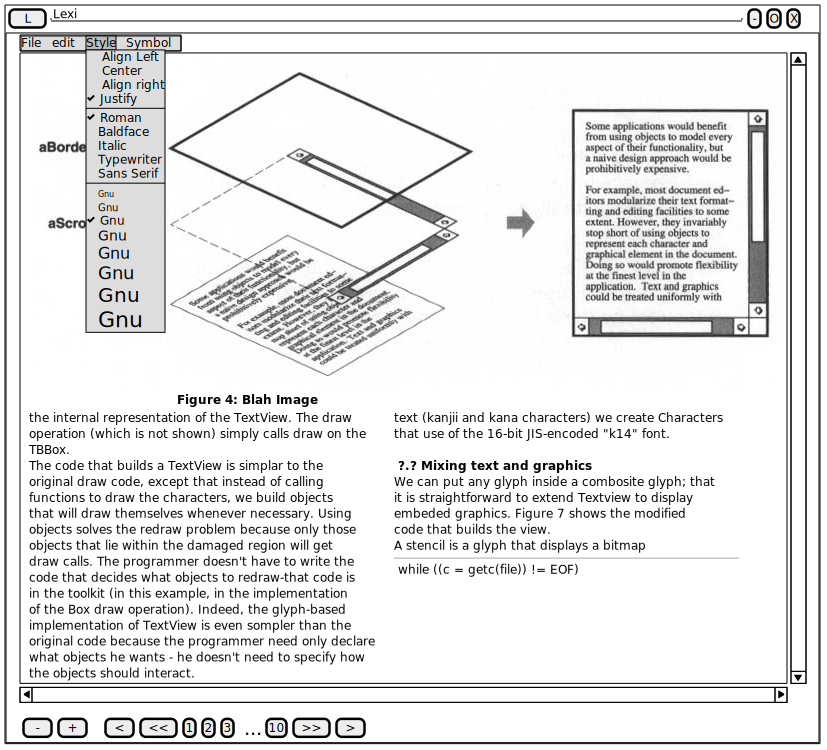
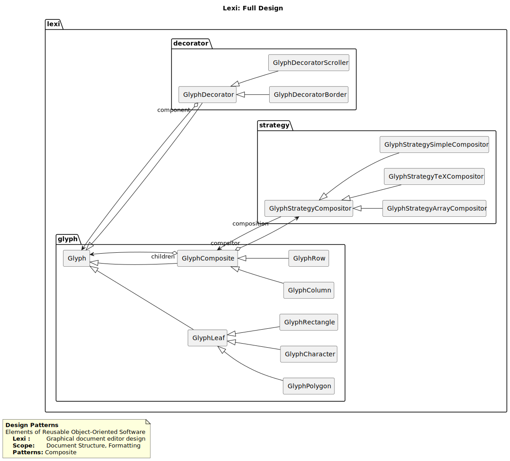

----------------
Lexi Text Editor
----------------

Rquirements Analysis
--------------------

    Figure 1.1: Lexi User interface

Design
------

Below figure shows a full design of the Lexi Text editor according the book implementation.

    Figure 1.0: Lexi Text Editor class diagram

Figure 1.1, models the required Lexi user interface, as depected by the book.

