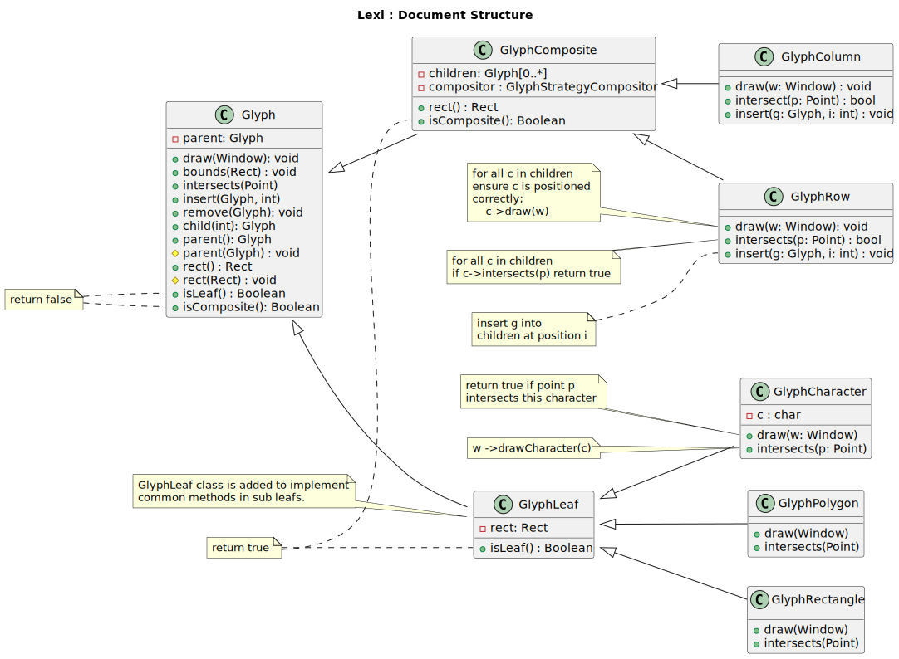
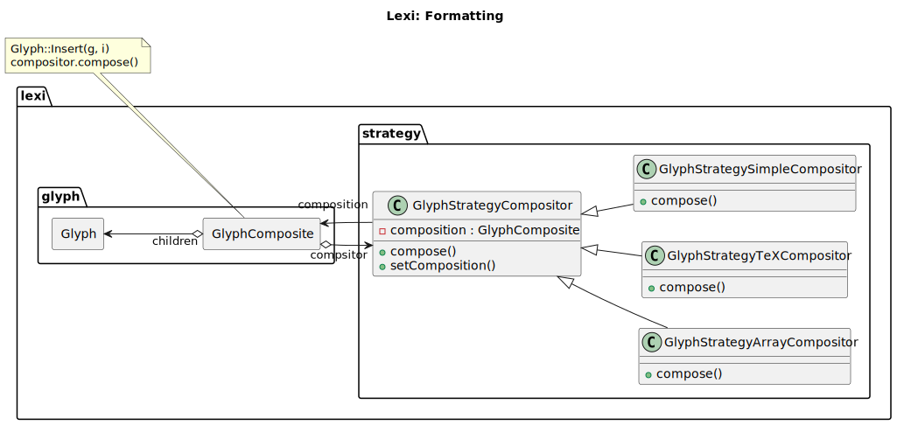

----------------
Lexi Text Editor
----------------

Rquirements Analysis
--------------------

.. figure:: docs/lexi_page.svg
    :width: 827
    :height: 920
    :scale: 60%
    :figwidth: 90%

    Figure 1: Lexi User interface

.. figure:: docs/lexi_usecases.svg
    :width: 581
    :height: 902
    :scale: 100%
    :figwidth: 90%

    Figure 2: Lexi Usecases

Design
------

Below figure shows a full design of the Lexi Text editor according the book implementation.

.. figure:: docs/lexi_classes.svg
    :width: 1396
    :height: 1025
    :scale: 40%
    :figwidth: 90%
    :alt: Combined Design
    :align: left

    Figure 3: Lexi Text Editor class diagram

Figure 1.1, models the required Lexi user interface, as depected by the book.

Document Structure
~~~~~~~~~~~~~~~~~~

    Figure 4: Lexi Text Editor class diagram

Formatting
~~~~~~~~~~

    Figure 5: Lexi Text Editor class diagram

Interface Imbellishment
~~~~~~~~~~~~~~~~~~~~~~~

    Figure 6: Lexi Text Editor class diagram

