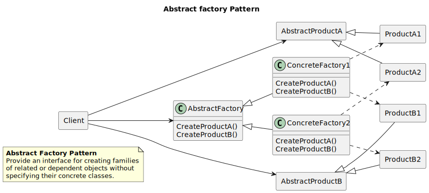
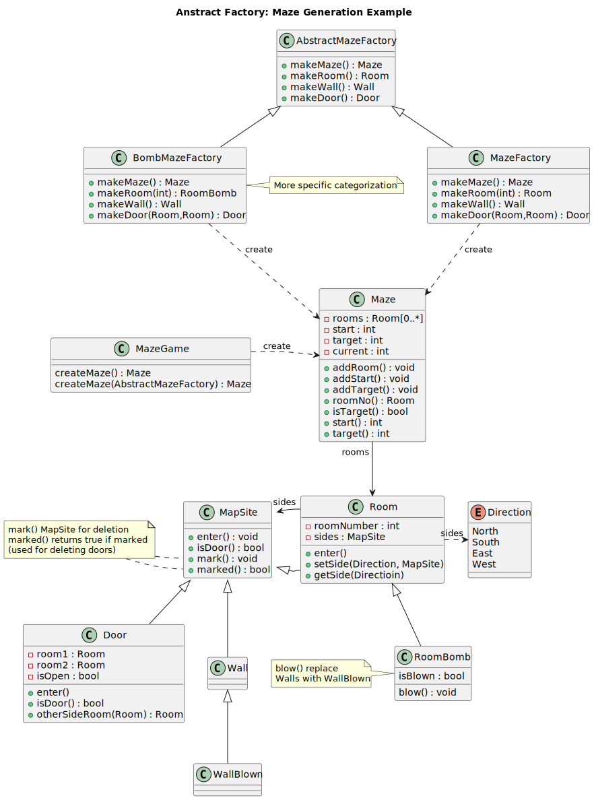

----------------
Abstract Factory
----------------

This pattern uses the Maze game example described at the begining of chapter 3, which creates a maze
game that creates several types of roomms and doors, and drops the player in starting room, then the task 
of the player to reach the target room using provided doors, that sounds fun.

Structure
---------

   Figure 1.1: Abstract Factory formal structure

Example
-------

Example used in the Motivation section is covering the case study's look and feel support of
Motif and Presentation Manager.

.. figure:: docs/abstract_factory_example.svg
   :width: 900
   :height: 400
   :scale: 70%
   :figwidth: 90%

   Figure 1.2: Abstract Factory example

Sample Code
-----------

The Maze game design.

Class diagram
*************

