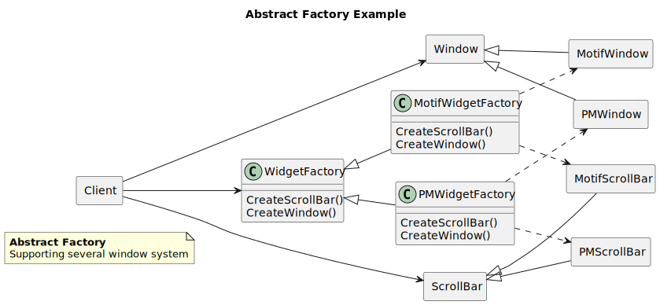

----------------
Abstract Factory
----------------

Structure
---------

   Figure 1.1: Abstract Factory formal structure

Example
-------

Example used in the Motivation section is covering the case study's look and feel support of
Motif and Presentation Manager.

   Figure 1.2: Abstract Factory example

Sample Code
-----------

Maze creation factory used in th Maze game is mentioned in the Creational Pattern chapter
introduction, which is creating a maze with several rooms and doors.

Class diagram
*************

.. figure:: docs/abstract_factory_sample.svg
   :width: 882
   :height: 1188
   :scale: 70%
   :figwidth: 90%

