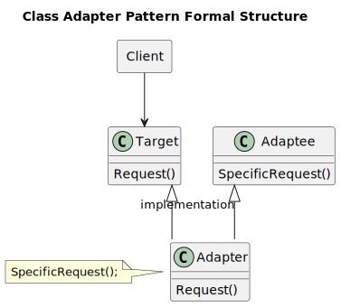
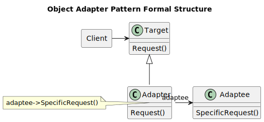
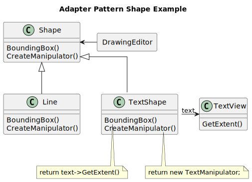
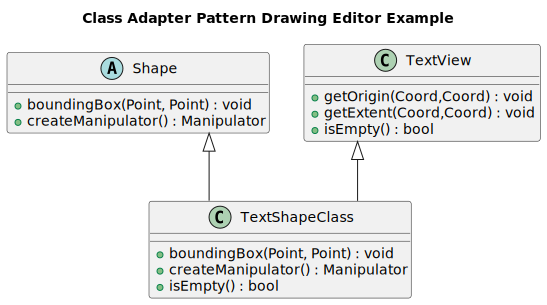
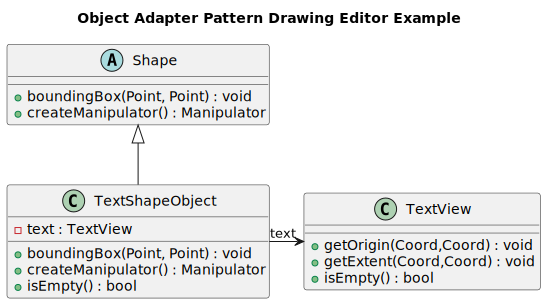

-----------------
Adapter Pattern
-----------------

Convert the interface of a class into another interface clients expect. Adapter lets
classes work together that couldn't otherwise because of incompatible interfaces.

Structure
---------

Adapter pattern can be implemented in one of two variations:

Class Adapter
~~~~~~~~~~~~~

Object Adapter
~~~~~~~~~~~~~~

Example
-------

Sample Code
-----------

