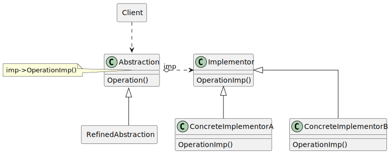
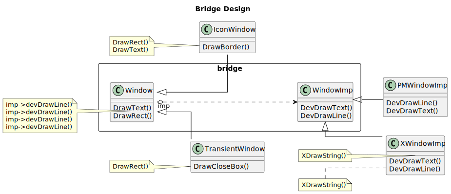
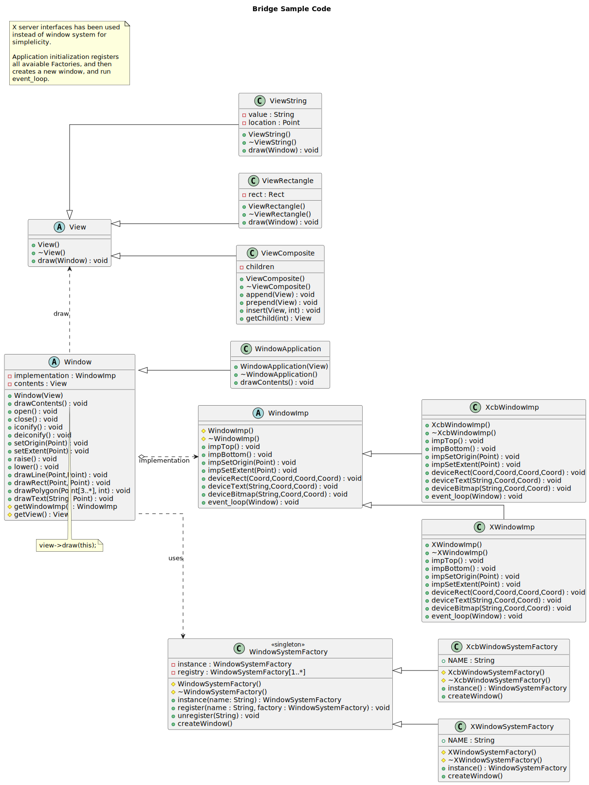

.. raw:: html

    

--------------
Bridge Pattern
--------------

Structure
----------

   Figure 1: Formal Bridge Pattern

Examples
--------

.. list-table:: Figure 2: Extending through inheritance causes class depth rush
    :width: 90%
    :align: center
    :widths: 45 5 45

    * - .. image:: docs/bridge_subclass_problem_1.svg
            :width: 226
            :height: 145
            :scale: 100%
            :align: right
      - =>
      - .. image:: docs/bridge_subclass_problem_2.svg
            :scale: 70%
            :width: 450
            :height: 241
            :align: left

   Figure 3: Bridge Design helps isolating abstractions from implementations

Sample Code
-----------

   Figure 4: Bridge sample code

This sample code just constructs a window and display a rectangle with *Hello Bridge!* in it
and it displays it using two **Window systems** (namely X11 and Qt5), using the bridge pattern.

Window and WindowImp classes represent the Abstraction and Implementation classes of
the structure respectively.

Event loop implementation has been added to the window class for simplicity, which
should be placed in its own class.

Other patterns is used in this sample such as Abstract Factory, Composite and Singleton.
