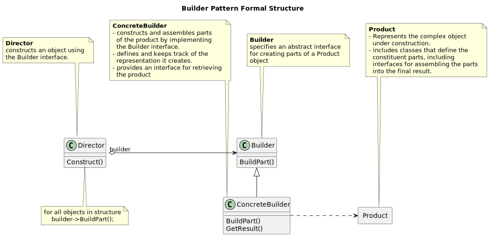
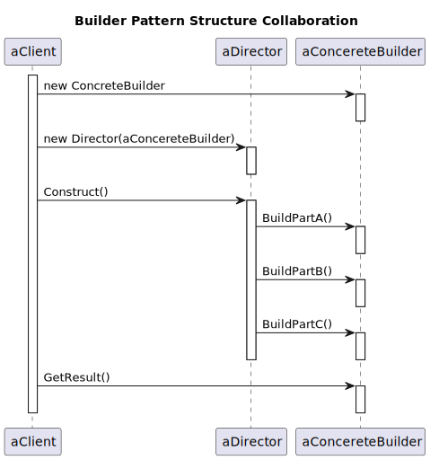
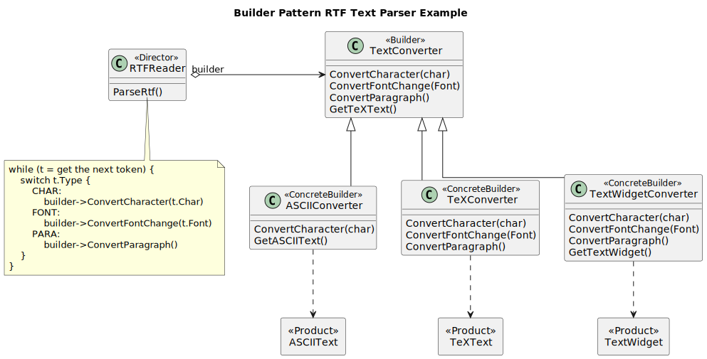
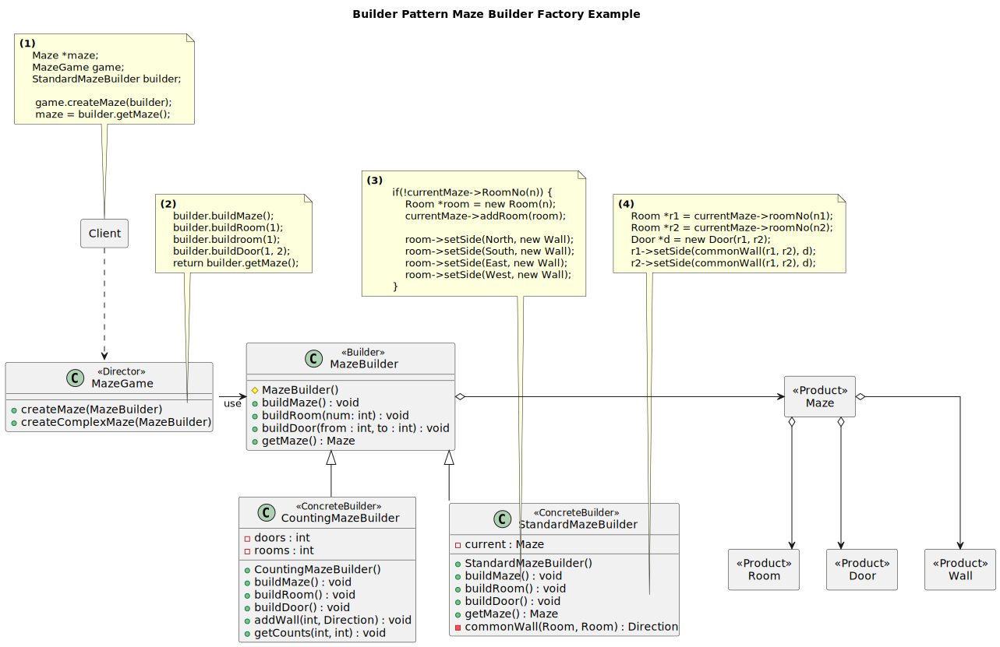
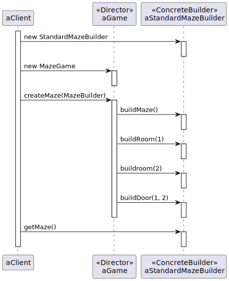

-----------------
Build Pattern
-----------------

Structure
---------

   Figure 1: Builder Pattern Formal Structure

   Figure 2: Builder Pattern Structure Collaboration

Example
-------

   Figure 3: Builder Pattern RTF Reader Example

Sample Code
-----------

   Figure 4: Builder Pattern Maze Game Example

   Figure 5: Builder Pattern Maze Game Collaboration
