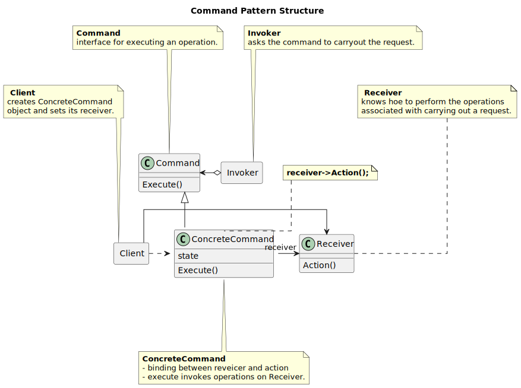
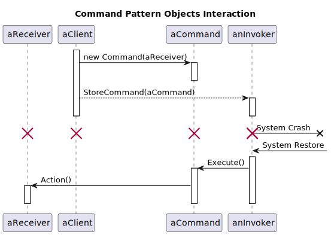
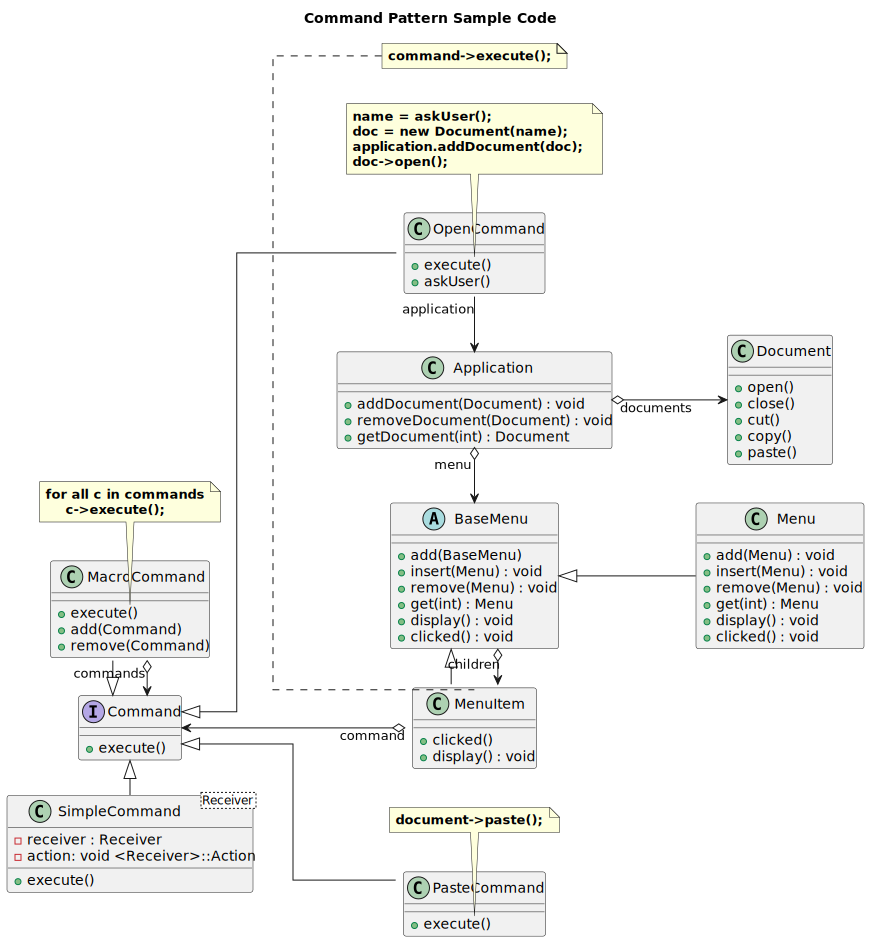

---------------
Command Pattern
---------------

Structure
---------

   Figure 1: Formal Command Pattern

   Figure 2: Formal Command Collaboration

Example
-------

.. figure:: docs/command_example.svg
   :width: 793
   :height: 589
   :figwidth: 90%
   :scale: 70%
   :align: center

   Figure 3: Command Pattern Example

Sample Code
------------

   Figure 3: Command Pattern Example
