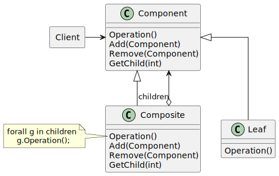
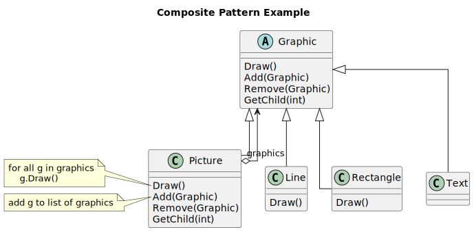
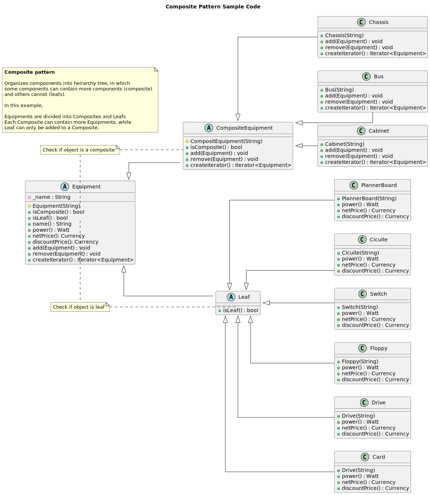

-----------------
Composite Pattern
-----------------

Compose objects into tree structures to represent part-whole hierarchies.

Structure
---------

   Figure 1: Composite Pattern Formal Structure

Example
-------

   Figure 2: Composite Pattern Graphics Example

Sample Code
-----------

   Figure 3: Composite Pattern Equipment Sample Code

