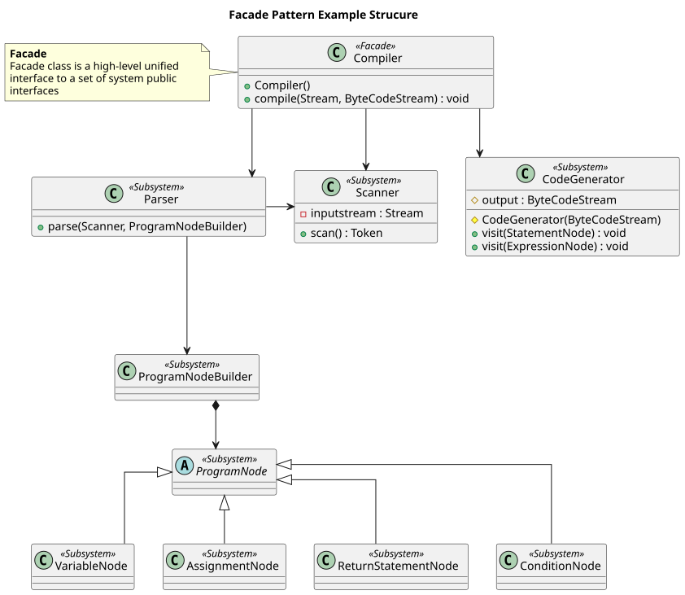
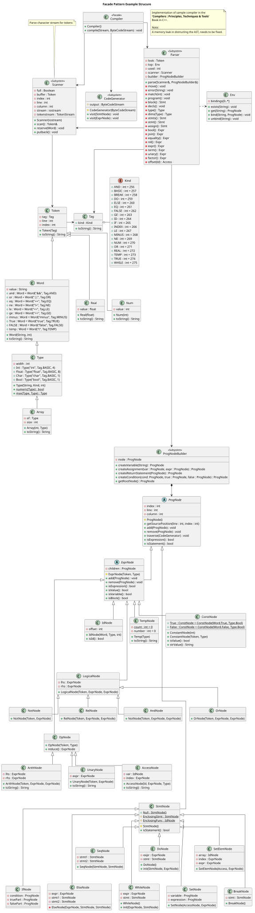

-----------------
Facade Pattern
-----------------

Provide a unified interface to a set of interfaces in a subsystem. Facade defines a
higher-level interface that makes the subsystem easier to use.

Structure
---------

Example
-------

The example used is the same as the sample code below.

Sample Code
-----------

