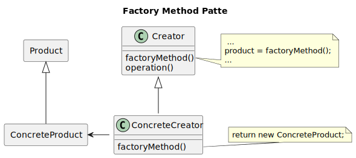
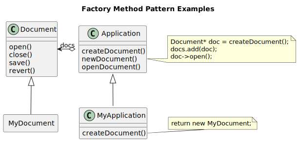
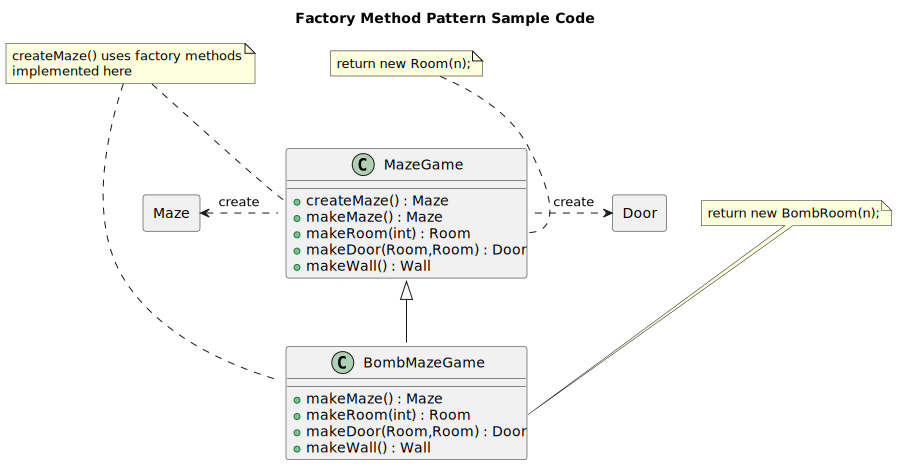

---------------
Factory Method
---------------

Structure
---------

   Figure 1.1: Factory Method Pattern Structure

Examples
--------

   Figure 1.2: Factory Method Example

Sample Code
-----------

   Figure 1.3: Factory Method Maze Game

Code
----

.. Attention:: Factory Method is not used in the maze game implementation, rather
    it uses the Abstract Factory Pattern, the code sample design for reference only.
