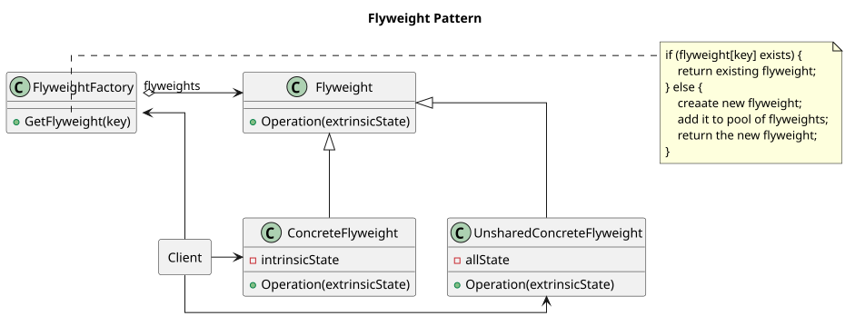
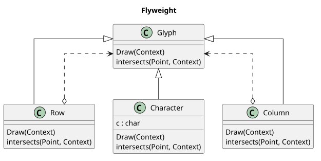
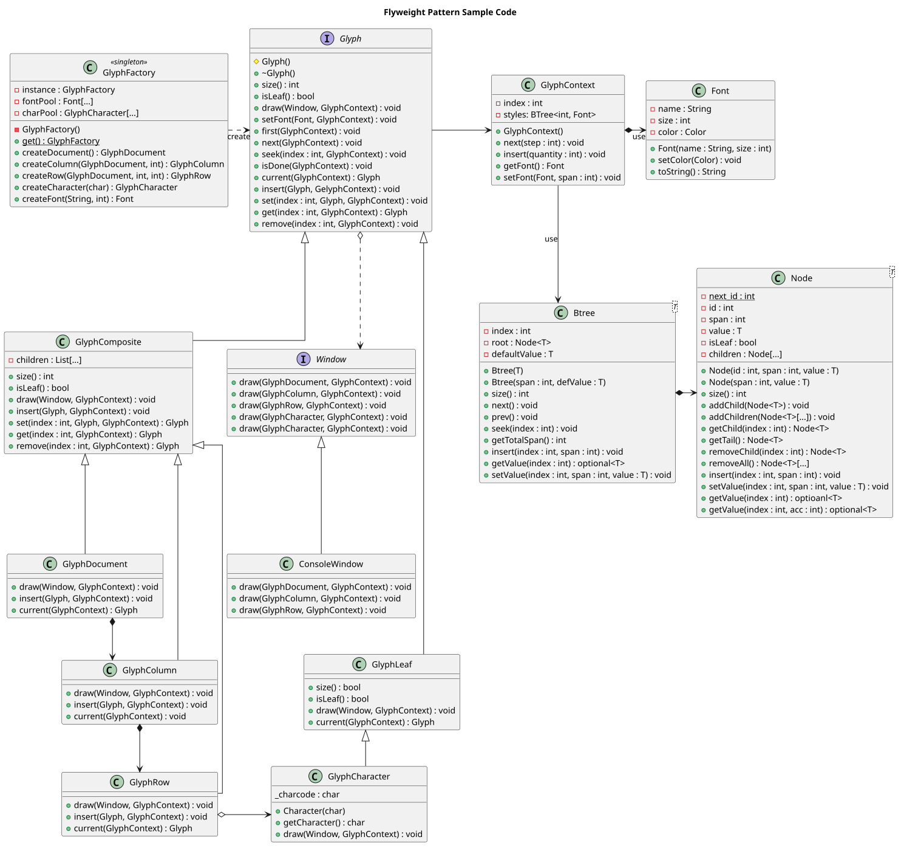

-----------------
Flyweight Pattern
-----------------

Use sharing to support large numbers of fine-grained objects efficiently.

When most objects used by the application is identical and can be created and held in a stock of objects that can be 
used later, and here the Flyweight Pattern comes into use (e.g. such as character objects in text editor applcations).

Structure
---------

Example
-------

Sample Code
-----------

