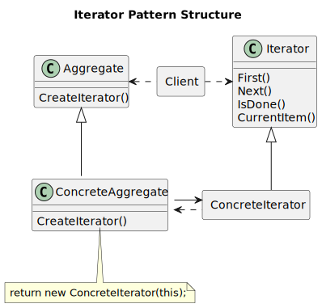
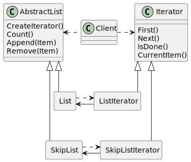
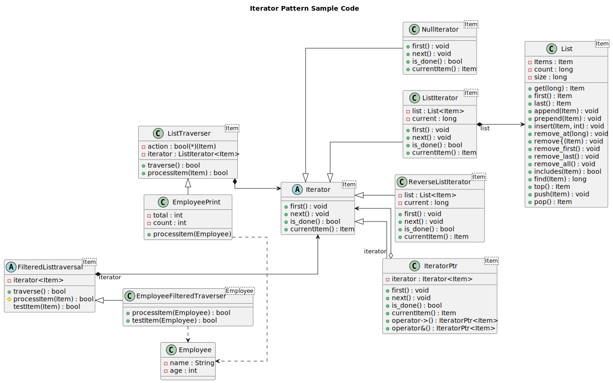

----------------
Iterator Pattern
----------------
Provide a way to access the elements of an aggregate object sequentially without exposing its underlying representation.

Structure
---------

   Figure 1: Iterator Pattern Formal Structure

Exmaple
-------

   Figure 2: Iterator Pattern Example

Sample Code
-----------
Several types of iterators are implemented here, forward and reverse.
Iterator implementation can be found in the common package `here <../../common/>`_, and 
is modelled here in figure 3

   Figure 3: Iterator Pattern Sample Code

Several iterators are implemented in the sample code, including forward, reverse, and filtered
iterators, in addition to the traversers, and the sample uses an employee object as an example
data.

