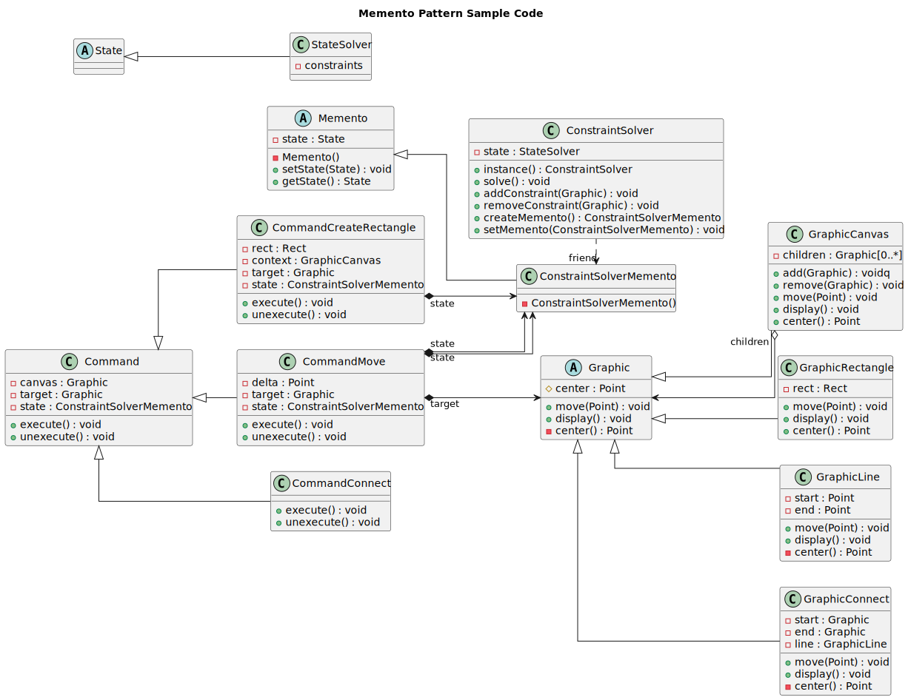

---------------
Memento Pattern
---------------

Without violating encapsulation, capture and externalize an object's internal state so that 
the object can be restored to this state later.

Structure
---------

   Figure 1: Formal Memento Pattern Structure

Example
-------

Care taker (*Command* classes) request a memento for current Originator(*ConstraintSolver*)
status, and saves it for later use in undo process, when it hands it over to the Originator
to restore its status back to how it was before command is executed.

.. figure:: docs/example.svg
   :width: 416
   :height: 364
   :figwidth: 90%
   :scale: 100%
   :align: center

   Figure 2: Formal Memento Pattern Structure

Sample Code
-----------

In this example, *ConstrainSolver* class is the memento originator, and the *Command* are
the memento caretakers, and in order to demonistrate that, a *Graphic* composite, and 
*Command* patterns has been implemented.

   Figure 3: Memento Pattern Sample Code

