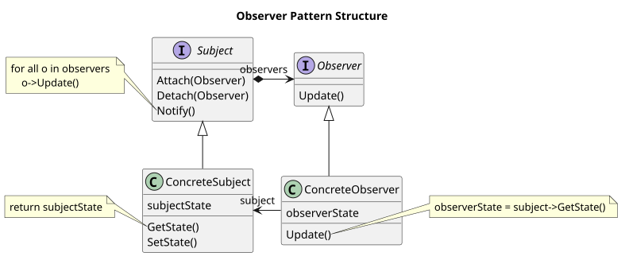
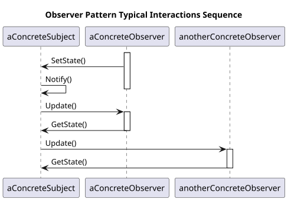
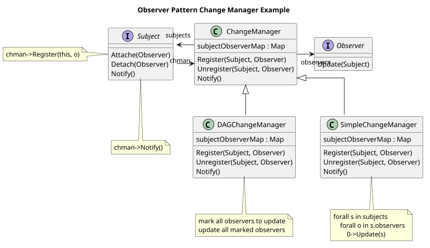
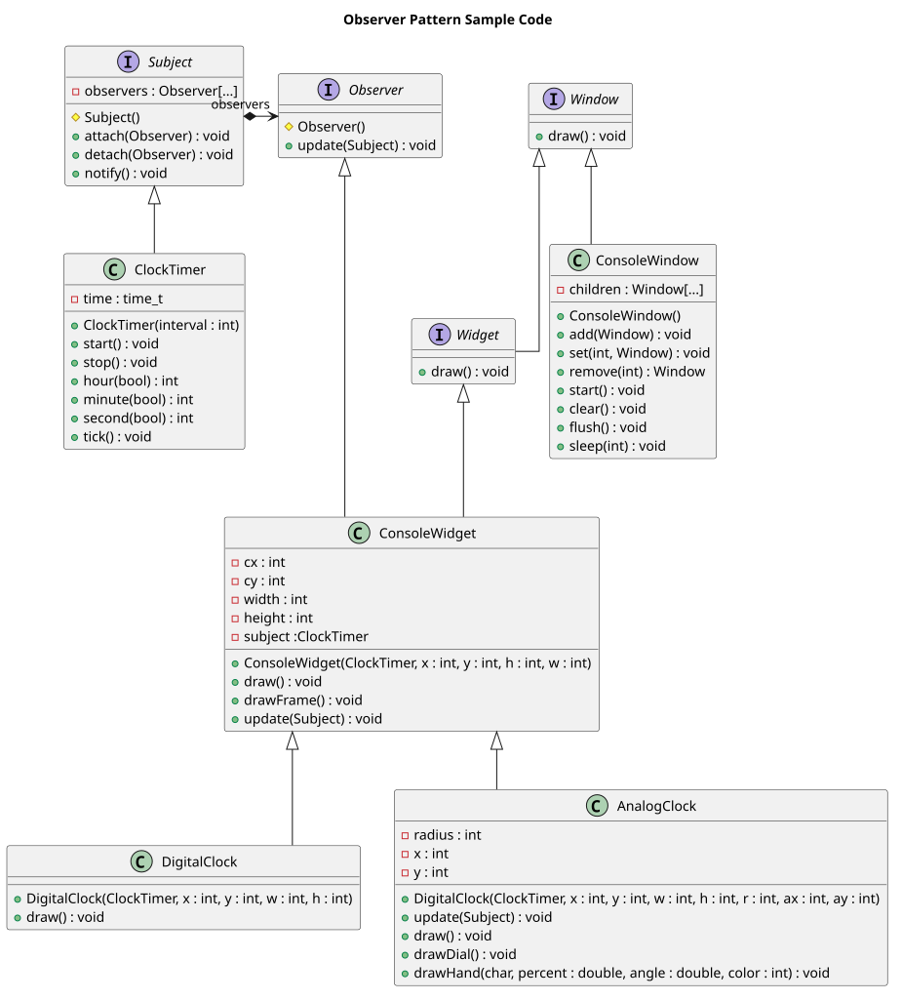

-----------------
Observer Pattern
-----------------

Define a one-to-many dependency between objects so that when one object
changes state, all its dependents are notified and updated automatically.

Structure
---------

Patterns is composed of two interfaces **Subject** and **Observer**, which are implemented by **ConcreteSubject** and **ConcreteObserver** classes, which might be any typical classes in the application that needs to be notified by other objects status updates.

Typical interactions between subjects and observers as as follows:

Example
-------

Sample Code
-----------

