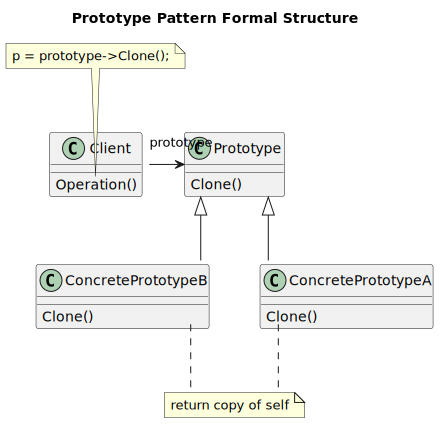
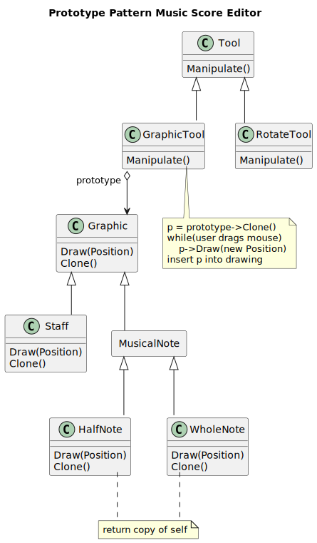
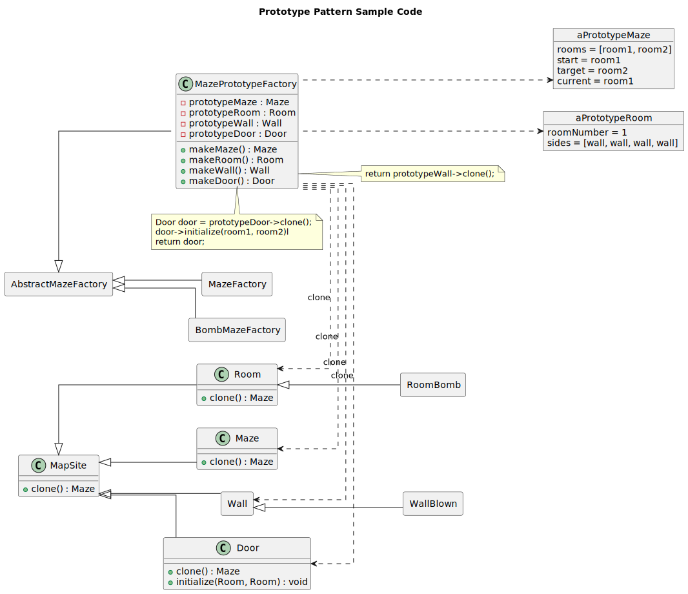

-----------------
Prototype Pattern
-----------------

This pattern implementation continues to use the maze game example described at the begining 
of chapter 2, and creates just one added factory based on prototype pattern.

The rest of the code can be found in the Abstract Factory project.

Structure
---------

   Figure 1: Prototype Pattern Formal Structure

Example
-------

   Figure 2: Prototype Pattern Example

Sample Code
-----------

   Figure 3: Prototype Pattern Maze Game Factory Addition

