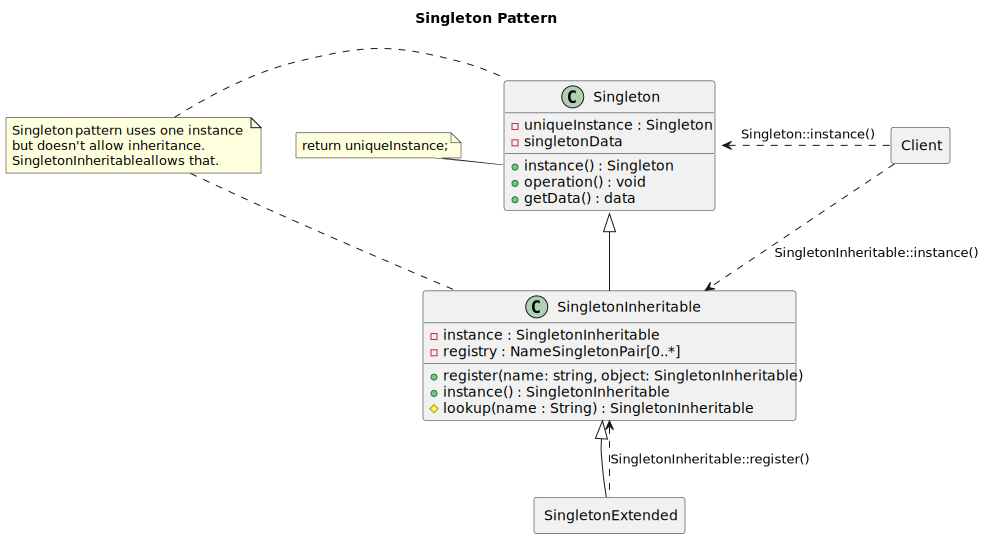
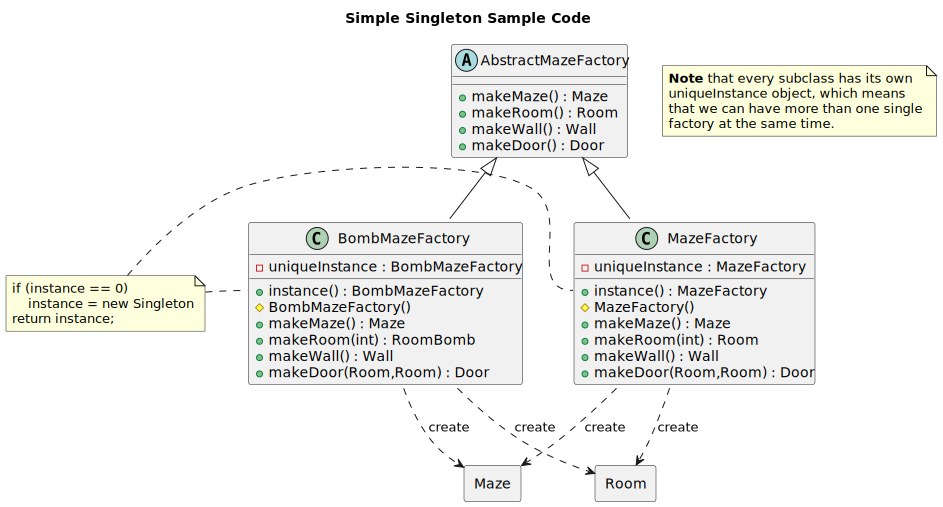
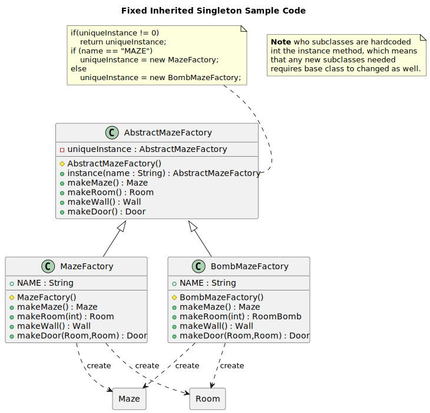
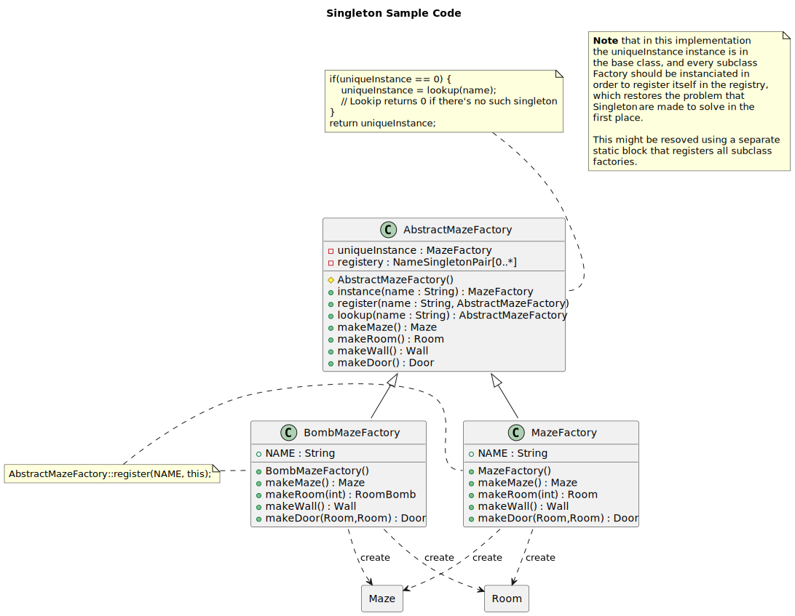

<<< `Back </>`_

---------
Singleton
---------

Structure
---------

   Figure 1.1: Standalone Singleton pattern (top) and an Inherited singleton (bottom)

Sample Code
-----------

Singleton pattern ensures that a class has one instance available in the application. This idiom has three several implementation variations, according to the project requirements.

First, that I call it the simple or streatforward singleton, in which each singleton class holds its own unique instance, which insures that we can only get one unique instance per class, but also we can have several factory instances of several types simultanously (refer to Figure: 1.2).

   Figure 1.2: Simple Inherited Singleton

Second, is the Fixed-Inheritance-Singleton, in which a base singleton class holds the singleton
inatance, which ensures that only one singleton can be instantiated at once, and clients can
request new instance by name, and only one factory is instanciated and saved for further
processing. (refer to Figure: 1.3)

   Figure 1.3: Fixed Inherited Singleton

Last, is the Full-Inheritance-Singleton, in which base singleton manages a list of registered
singletons, and every singleton should register itself in that registry in order for instance
to avaiable for clients to recall, using the instance() method. (refer to Figure: 1.4)

   Figure 1.4: Full Inherited Singleton

.. note:: Singleton implementation can be found in the abstract factory sample code
