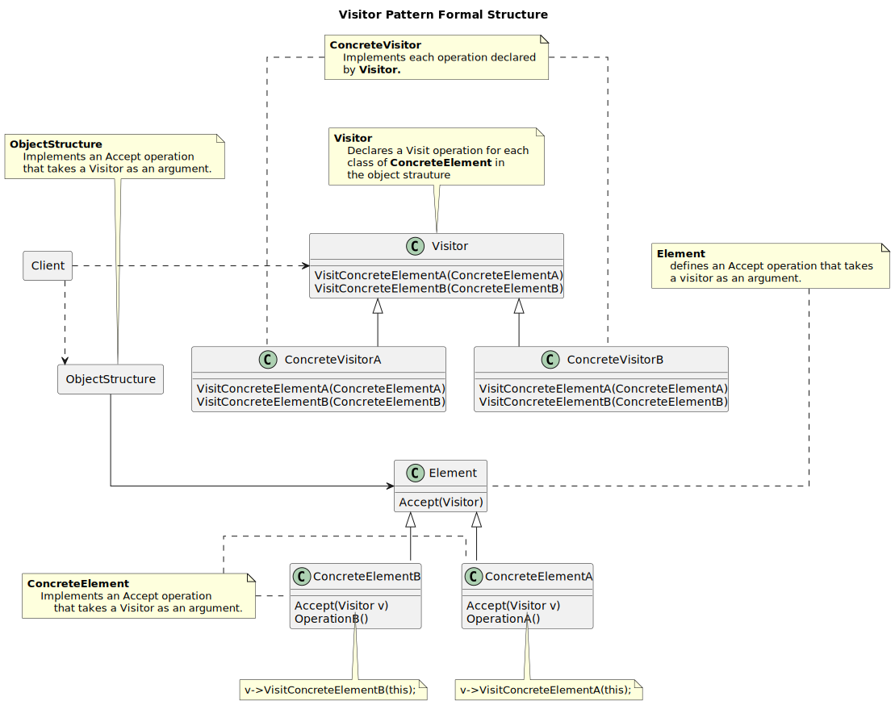
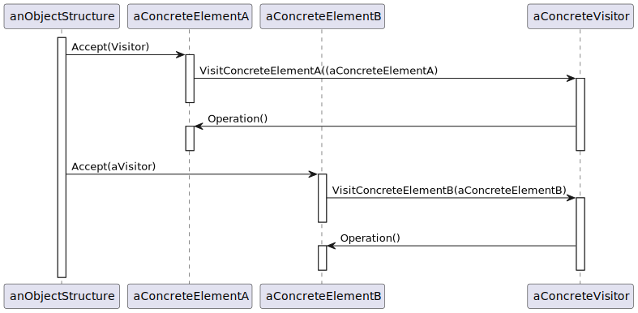
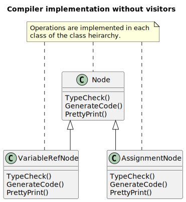
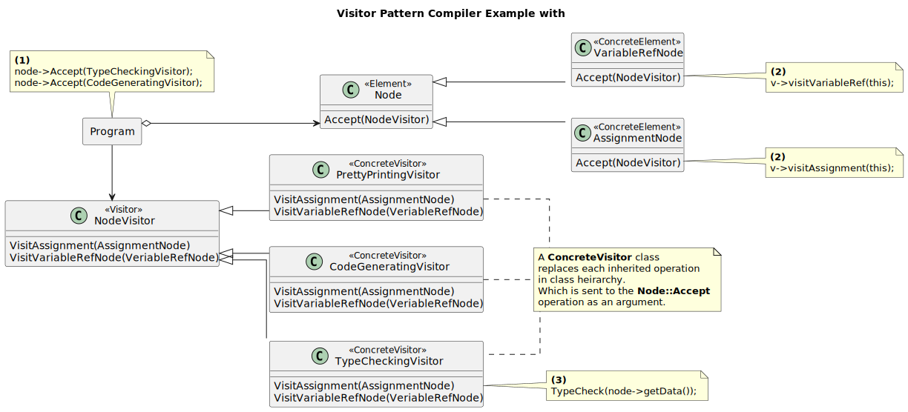
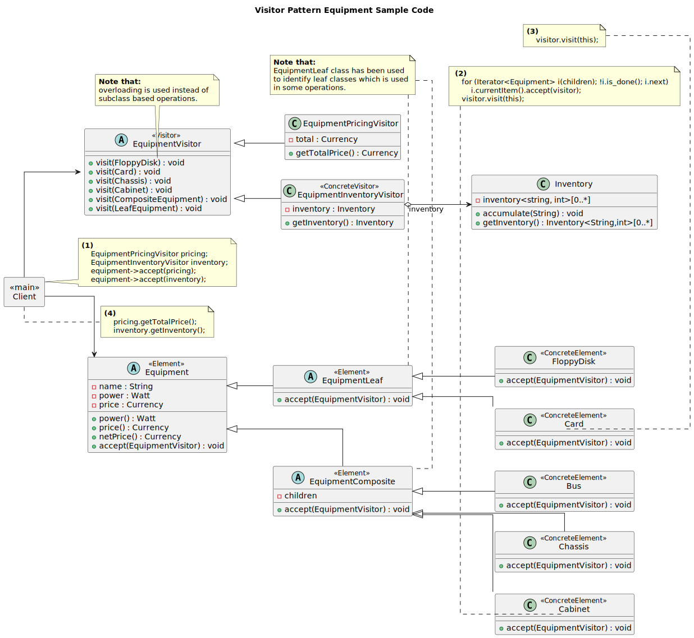

-----------------
Visitor Pattern
-----------------

Represents an operation to be performed on the elements of an object.

Most of this project implementation is added into the composite application, which is the Element
Accept implementation and the visitor base classes, it can be found `Composite <../composite/>`_

Structure
---------

   Figure 1: Visitor Pattern Formal Structure

   Figure 2: Visitor Pattern Structure Collaboration

Example
-------

   Figure 3: Visitor Pattern Compiler Implementation class heirarchy

   Figure 4: Visitor Pattern Compiler Implementation with Visitors.

Sample Code
-----------

This sample is implemented using both function overloading.

   Figure 5: Visitor Pattern Equipment Sample Code Implementation

